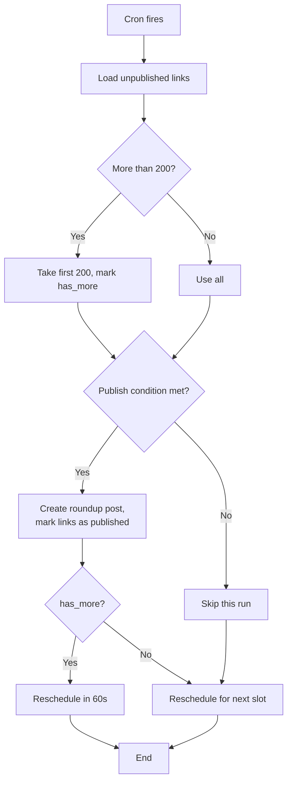

# LinkDigest Scheduler — User Manual

The scheduler automatically publishes your saved links as roundup posts at times or under conditions you define. This manual covers every setting on the **LinkDigest › Schedule** admin page.

---

## Table of Contents

_Concepts_

- [Quick start](#quick-start)
- [How the scheduler works](#how-the-scheduler-works)
- [Getting to the Schedule page](#getting-to-the-schedule-page)
- [Mode comparison](#mode-comparison)
- [Choosing a mode](#choosing-a-mode)

_Modes_

- [Daily mode](#daily-mode)
- [Weekly mode](#weekly-mode)
- [Monthly mode](#monthly-mode)
- [By Count mode](#by-count-mode)
- [By Age mode](#by-age-mode)
- [Manual mode](#manual-mode)

_Operations_

- [Execution times](#execution-times)
- [Previewing upcoming runs](#previewing-upcoming-runs)
- [Saving the schedule](#saving-the-schedule)
- [Running the schedule immediately](#running-the-schedule-immediately)
- [Notifications](#notifications)
- [What a roundup post looks like](#what-a-roundup-post-looks-like)
- [Edge cases and caveats](#edge-cases-and-caveats)

_Reference_

- [Configuration storage](#configuration-storage)
- [Capabilities](#capabilities)
- [Server-side cron setup](#server-side-cron-setup)
- [WP-CLI usage](#wp-cli-usage)
- [Logging and observability](#logging-and-observability)
- [Developer hooks](#developer-hooks)
- [Internationalisation](#internationalisation)
- [FAQ](#faq)

---

## Quick start

1. Open **LinkDigest › Schedule**.
2. Pick a mode (Daily is a good default).
3. Set at least one **Execution Time** (e.g. `09:00`).
4. Click **Save Schedule**.
5. Add some links. The next time the scheduled moment arrives, LinkDigest will publish a roundup post.

To trigger a run on demand, use the **Run Now** button on the LinkDigest dashboard. To stop all automation, switch to [Manual mode](#manual-mode).

---

## How the scheduler works

When you save a schedule, LinkDigest registers a WordPress cron event. At each scheduled moment the plugin:

1. Collects all unpublished links.
2. Caps the working set at **200 links per run** to avoid PHP timeouts (see [Large queues](#large-queues)).
3. Checks whether the configured publish condition is met.
4. If it is, groups the links by category and creates a single roundup blog post, then marks every included link as published so it won't appear in future roundups.
5. Reschedules itself for the next run (except in [Manual mode](#manual-mode), where no automatic reschedule occurs).

Nothing is published until the condition is satisfied. If you are in a time-based mode (Daily, Weekly, Monthly) and there are no unpublished links at the scheduled time, the run is skipped and the next event is set as usual.



---

## Getting to the Schedule page

In the WordPress admin sidebar, go to **LinkDigest › Schedule**.

You need the `manage_options` capability (administrator role by default) to view or save the schedule. See [Capabilities](#capabilities) for details.

---

## Mode comparison

| Mode    | Trigger to publish                                | Recurrence settings          | Execution Times apply | Next-runs preview |
| ------- | ------------------------------------------------- | ---------------------------- | --------------------- | ----------------- |
| Daily   | Time slot reached **and** ≥1 unpublished link     | Every N days                 | Yes                   | Yes               |
| Weekly  | Matching weekday + time slot **and** ≥1 link      | Every N weeks · weekdays     | Yes                   | Yes               |
| Monthly | Matching day-of-month + time slot **and** ≥1 link | Every N months · day entries | Yes                   | Yes               |
| Count   | Time slot reached **and** unpublished count ≥ N   | —                            | Yes                   | No                |
| Age     | Time slot reached **and** oldest link > N days    | —                            | Yes                   | No                |
| Manual  | Never (only **Run Now** publishes)                | —                            | No                    | No                |

---

## Choosing a mode

The **Mode** panel at the top of the page offers six options grouped in two rows:

| Group         | Modes                    |
| ------------- | ------------------------ |
| Time-based    | Daily · Weekly · Monthly |
| Trigger-based | By Count · By Age        |
| —             | Manual                   |

Select one mode. The panels below update immediately to show the relevant settings.

---

## Daily mode

Publishes at a fixed time every N days, as long as at least one unpublished link exists.

**Setting: Every N days**

Enter a number between 1 and 365.

- `1` → runs every day
- `2` → runs every other day
- `7` → roughly weekly (the next run is computed forward from _now_, not from the previous run; if you change settings mid-cycle the cadence resets)

Pair this with one or more [Execution Times](#execution-times).

**Example:** Every day at 08:00 means the scheduler wakes up each morning at 08:00. If there are unpublished links, it publishes them. If not, it does nothing and waits until 08:00 the following day.

**Timeline (every 1 day at 08:00):**

```
Mon 08:00 ✓   Tue 08:00 ✓   Wed 08:00 ✓   Thu 08:00 ✓ …
```

---

## Weekly mode

Publishes on specific days of the week at a fixed time.

**Setting: Every N weeks**

Enter a number between 1 and 52.

- `1` → every week on the selected days
- `2` → every other week on the selected days

**Setting: Weekdays**

Toggle any combination of Mon, Tue, Wed, Thu, Fri, Sat, Sun. The compact UI labels them **M T W T F S S** (left-to-right Monday through Sunday). At least one day **must** be selected; if none are selected the scheduler never fires.

Pair this with one or more [Execution Times](#execution-times).

**Example:** Every 1 week on Monday and Thursday at 09:00 — a roundup is published on Monday morning and again Thursday morning, provided there are unpublished links each time.

**Timeline (Mon + Thu at 09:00):**

```
Mon 09:00 ✓   Tue —   Wed —   Thu 09:00 ✓   Fri —   Sat —   Sun —
```

---

## Monthly mode

Publishes once (or more) per month on dates you define.

**Setting: Every N months**

Enter a number between 1 and 12.

- `1` → every month
- `3` → every quarter

**Setting: Day entries**

Each entry defines one day within the month on which to publish. You can add multiple entries using **+ Add day**; each additional entry adds an "or" condition. The scheduler fires on **every** matching day in the month, not just the earliest — so two entries that resolve to two different dates produce two roundups in that month.

Each entry offers two selectors. Click one to activate it:

- **Calendar day** — a fixed date from 1 to 31. If the month has fewer days (e.g. 30), the 31st is skipped that month and the next eligible entry is used instead.
- **Ordinal weekday** — a relative date expressed as "the Nth Weekday":
  - _Nth_: first / second / third / fourth
  - _Weekday_: Mon through Sun

  Example: "the first Monday" or "the third Friday".

To remove an entry, click **✕** to its right. At least one entry must remain.

Pair this with one or more [Execution Times](#execution-times).

**Example:** Every 1 month, on the 1st _and_ the first Monday — in a month where these resolve to two different dates, both will fire (so up to two roundups). If the 1st itself falls on a Monday, only one run occurs that month.

---

## By Count mode

Publishes when the number of unpublished links reaches or exceeds a threshold. The scheduler checks this condition at every configured [Execution Time](#execution-times).

**Setting: Publish when there are at least N unpublished links**

Enter any positive integer. Default is 10.

The check is: `unpublished count ≥ N`. When true, all current unpublished links are published in one roundup post (subject to the global [200-link per-run cap](#large-queues)).

**Example:** Set to 15. The scheduler wakes up each morning at 09:00. On days when you have fewer than 15 links saved, nothing happens. Once you reach 15, the next 09:00 check publishes them all and resets the queue.

---

## By Age mode

Publishes when the oldest unpublished link is **older than** N days. The scheduler checks this condition at every configured [Execution Time](#execution-times).

**Setting: Publish when the oldest unpublished link is older than N days**

Enter any positive integer. Default is 7.

The check inspects the creation date of the oldest unpublished link. The condition is satisfied when that link's creation timestamp is strictly earlier than `now − N days` (i.e. the link has aged for more than N days). When true, the next scheduled check triggers a full publish of all unpublished links.

**Example:** Set to 14. Links saved less than two weeks ago accumulate silently. Once any link has been sitting for more than 14 days, the next scheduled check publishes everything — even links that are only 1 day old — in one roundup.

---

## Manual mode

Disables all automatic publishing. No cron event is scheduled.

Use the **Run Now** button on the LinkDigest dashboard to trigger a roundup post on demand. (The dashboard's _Publish Links_ form, with its **Publish** / **Save as Draft** buttons, achieves the same result and lets you customise the post title.)

Choose this mode if you want full control over timing, or if you are still building up your link queue and are not ready for automated publishing.

---

## Execution times

Applies to all modes **except Manual**.

The **Execution Times** panel lets you specify one or more times of day (HH:MM, 24-hour format) at which the scheduler wakes up.

- **Add a time** — click **+ Add time**. A new row is added with a default of 09:00.
- **Change a time** — click the time input and type or use the browser's time picker.
- **Remove a time** — click **✕** beside the row. At least one time must remain; the remove button is hidden when only one time is present.
- **Duplicate times** — the form rejects duplicate values on save with the error notice _"Execution times must be unique."_ Each time must be unique.

**Multiple times per day**

Adding several times means the scheduler can publish more than once per day. For trigger-based modes (By Count, By Age) this is useful if you want the condition checked frequently. For time-based modes it means a roundup is published at each matching time on qualifying days — _only if unpublished links exist at each check_.

**Example:** 08:00 and 18:00 in Weekly mode on Monday — one roundup in the morning if links are waiting, and another in the evening if more links have been added since.

---

## Previewing upcoming runs

The **Next 10 Schedules** sidebar panel (visible in Daily, Weekly, and Monthly modes) lists the next ten dates on which the scheduler will wake up, based on your current settings.

Each row shows:

- The day and date (e.g. `Mon 5 May 2026`)
- The execution time(s) configured

This preview updates live as you change settings — before you save. Use it to verify that your recurrence pattern produces the dates you expect.

> The panel is hidden in By Count, By Age, and Manual modes because those modes don't have predictable future dates.

---

## Saving the schedule

Click **Save Schedule** at the bottom of the settings column. A notice confirms success or reports an error.

On save:

- The new config is stored in WordPress.
- Any previously pending cron event is cancelled.
- A new cron event is scheduled for the next matching time.

---

## Running the schedule immediately

The **Run Now** button on the **LinkDigest dashboard** triggers an immediate publish run. It respects the same publish condition as the automatic schedule:

- In By Count or By Age modes: only publishes if the threshold is currently met.
- In time-based modes: publishes if any unpublished links exist.
- In Manual mode: publishes if any unpublished links exist (no other condition applies).

In every mode, the run is silently skipped when there are no unpublished links — no empty roundup is ever created.

The automatic schedule is unaffected — the next cron event remains scheduled as normal.

---

## Notifications

LinkDigest can notify you after each publish run via **email**, **Discord**, or **Slack**.
Configure each channel in the **Notifications** panel on the Schedule page and click **Save Schedule**.

Notifications fire only when a roundup post is actually created. Skipped runs (condition not met, no links, locked) produce no notification.

### Email

Check **Email me after each run** to receive a notification email.

- **Email address** — leave blank to use the WordPress admin email (`Settings › General`). Enter a specific address to override it.

The email contains the link count and a direct URL to the roundup post.

### Discord

1. In your Discord server open **Server Settings › Integrations › Webhooks**.
2. Click **New Webhook**, choose a channel, and copy the webhook URL.
3. Paste it into **Discord Webhook URL** on the Schedule page and save.

Leave the field blank to disable Discord notifications.

**Example message:**

> **LinkDigest: roundup published**
> 12 links published. [View post](https://example.com/links-may-8-2026/)

### Slack

1. Go to **api.slack.com/apps**, create or select an app.
2. Enable **Incoming Webhooks**, click **Add New Webhook to Workspace**, pick a channel, and copy the URL.
3. Paste it into **Slack Webhook URL** on the Schedule page and save.

Leave the field blank to disable Slack notifications.

**Example message:**

> *LinkDigest:* 12 links published. <https://example.com/links-may-8-2026/|View post>

### Notes

- Webhooks are sent as **fire-and-forget** (`blocking: false`). A slow or unreachable endpoint does not delay or abort the publish run.
- All three channels are independent — you can enable any combination.
- Notifications are sent in Manual mode too, when a **Run Now** triggers an actual post.

---

## What a roundup post looks like

**Title.** Each run creates one WordPress post titled `Links: [Full Date]` — for example `Links: April 28, 2026`. The format is the translatable string `__('Links: %s', 'linkdigest')` with the current date formatted via `wp_date('F j, Y')`, so it follows the WordPress site timezone and locale.

**Post type and status.** The roundup is created as a regular WordPress `post` (not a `linkdigest` custom-post-type entry), with `post_status = 'publish'`.

**Author.** When the cron event runs unauthenticated (the usual case), LinkDigest temporarily switches the current user to the first administrator returned by `get_users(['role' => 'administrator'])` so the post insert passes its `current_user_can('publish_posts')` guard. The roundup is therefore attributed to that administrator. When **Run Now** is invoked from the admin UI, the post is attributed to the current user.

**Body.** The body contains one section per category, each with a `<ul>` list of links. Each `<li>` contains a link title (anchored to the saved URL when present, with `target="_blank" rel="noopener"`) and, optionally, a description below it (sanitised through `wp_kses_post`). Uncategorised links appear in their own section at the end.

**Taxonomies.** No categories or tags are applied to the roundup post itself — it inherits the site's default category as configured in **Settings › Writing**.

**Side effects.** Every included link is marked as published (post meta `_linkdigest_publish_status = 'published'`) and is excluded from future roundups.

---

## Edge cases and caveats

### WP-Cron timing

WordPress's built-in cron system fires when a visitor loads a page. On low-traffic sites, the actual run may be a few minutes late. For precise timing, set up a real system cron job on your server to call `wp-cron.php` at a regular interval (see [Server-side cron setup](#server-side-cron-setup)).

### Large queues

To prevent PHP timeouts, a single run processes at most **200 links**. If you have more than 200 unpublished links, the scheduler publishes the first 200, schedules itself to run again 60 seconds later, and then reschedules its normal next slot. This continues until the queue is empty.

### Months shorter than the configured day

In Monthly mode, if you set the 31st and the current month has only 30 days, that entry is skipped for that month. Add a second entry (e.g. the last Friday) as a fallback if you need reliable monthly coverage.

### No links available

The scheduler never publishes an empty roundup. If there are no unpublished links when the cron fires, the run is silently skipped and the next event is scheduled normally.

### Timezone and DST

Execution times use your WordPress site's configured timezone (Settings › General › Timezone). Make sure this is set correctly before configuring the schedule. On daylight-saving transitions:

- **Spring forward** — if your execution time falls inside the skipped hour (e.g. 02:30 in many regions), PHP's `DateTime` will resolve it to the next valid local moment, so the run is shifted forward by approximately one hour that day.
- **Fall back** — if your execution time falls inside the repeated hour, the run fires once at the first occurrence of that local time.

### Backfill after long downtime

If your site is offline (or WP-Cron isn't firing) when one or more scheduled moments pass, those events are missed silently — LinkDigest does **not** backfill multiple roundups. As soon as WordPress runs again, a single catch-up run executes (if a previously scheduled event is still pending) and the next slot is computed forward from the current time. To force a catch-up immediately, use **Run Now**.

### Run failures

If `wp_insert_post` fails for the roundup post (for example due to a misconfigured filter or an out-of-disk condition), the included links remain marked as unpublished and will be retried on the next scheduled run. Individual link rendering errors are skipped silently and do not abort the run.

### Concurrent runs

Each scheduled event is registered with `wp_schedule_single_event`, and a new event is only created after the previous one has fired. WordPress's cron system itself protects against parallel execution of the same event within a single page load, so you should not see duplicate roundup posts under normal conditions.

### Deactivating the plugin

Deactivating LinkDigest automatically cancels any pending cron event (`wp_clear_scheduled_hook('linkdigest_execute_schedule')`). No stale jobs are left in WordPress's cron queue.

### Uninstalling the plugin

Uninstall does **not** delete the `linkdigest_schedule` option or any saved links. If you want a clean slate, manually remove the option (e.g. via `wp option delete linkdigest_schedule`) before reinstalling.

---

## Configuration storage

The schedule configuration is stored as a single WordPress option:

- **Option name:** `linkdigest_schedule`
- **Shape:**
  - `mode` — one of `daily`, `weekly`, `monthly`, `count`, `age`, `manual`
  - `times` — array of `HH:MM` strings (24-hour)
  - `recurrence` — `{ interval, weekdays?, monthDays? }` (mode-dependent)
  - `trigger` — `{ type, count?, days? }` for trigger-based modes; `null` otherwise
  - `rrule` — RFC 5545 recurrence rule string (time-based modes only)

The cron event itself is registered under the hook `linkdigest_execute_schedule`. You can inspect it with [WP-CLI](#wp-cli-usage) or with the [WP Crontrol](https://wordpress.org/plugins/wp-crontrol/) plugin.

---

## Capabilities

| Action                                          | Capability       |
| ----------------------------------------------- | ---------------- |
| View **LinkDigest › Schedule** page             | `manage_options` |
| Save the schedule (REST `POST /schedule`)       | `manage_options` |
| Trigger **Run Now** (REST `POST /schedule/run`) | `manage_options` |

By default only administrators have `manage_options`. To delegate, grant the capability to a custom role using a tool such as the _User Role Editor_ plugin or `add_cap()` in your own code.

---

## Server-side cron setup

WP-Cron only fires when a visitor hits the site. For reliable scheduling, replace it with a real cron job:

1. **Disable WP-Cron** in `wp-config.php`:

   ```php
   define( 'DISABLE_WP_CRON', true );
   ```

2. **Add a system cron entry** that hits `wp-cron.php` every minute:

   ```cron
   * * * * * curl -sS https://example.com/wp-cron.php?doing_wp_cron > /dev/null 2>&1
   ```

   Or, if WP-CLI is available:

   ```cron
   * * * * * cd /path/to/wordpress && /usr/local/bin/wp cron event run --due-now > /dev/null 2>&1
   ```

The minute granularity is what gives the LinkDigest scheduler its precision. Without this, runs may be delayed by minutes or hours on low-traffic sites.

---

## WP-CLI usage

LinkDigest does not register custom WP-CLI commands, but the standard cron commands work because the plugin registers a normal WordPress cron hook:

```bash
# List all cron events (filter for LinkDigest)
wp cron event list | grep linkdigest

# Force an immediate run (equivalent to Run Now)
wp cron event run linkdigest_execute_schedule

# Inspect or modify the saved schedule
wp option get linkdigest_schedule --format=json
wp option delete linkdigest_schedule
```

---

## Logging and observability

The scheduler does not write to a custom log. To verify a run happened, check:

1. **Posts › All Posts** — a new "Links: …" post appears on each successful run.
2. **WP Crontrol** plugin — shows the next-scheduled time for `linkdigest_execute_schedule`.
3. **WP-CLI** — `wp cron event list` shows pending events and their next-run timestamps.
4. The **Next 10 Schedules** panel on the Schedule admin page (time-based modes only).

If you need detailed tracing, enable `WP_DEBUG_LOG` in `wp-config.php` and add custom logging via the action below.

---

## Developer hooks

The plugin currently exposes the following hook for the scheduler:

- **Action `linkdigest_execute_schedule`** — fires when the cron event runs. Bound to `LinkDigest::executeSchedule()`. You can `add_action` your own callback to log runs, send notifications, or perform housekeeping. The action receives no arguments.

There are no scheduler- or roundup-specific filters at present (post title, post body, post arguments are not filterable). If you need such hooks, file an issue describing the use case.

---

## Internationalisation

All user-facing strings in the schedule UI and the roundup post title are wrapped in `__()` / `_e()` against the **`linkdigest`** text domain. Translations live under `/languages/`; the canonical template is `languages/linkdigest.pot`.

To add or update a language:

```bash
# Regenerate the POT file
composer run i18n:pot
# Or, directly:
wp i18n make-pot . languages/linkdigest.pot --domain=linkdigest --exclude=vendor,node_modules,tests
```

Date formatting in roundup post titles uses `wp_date()`, which respects both the site timezone and the active translation, so a German install will produce _Links: 28. April 2026_ automatically.

---

## FAQ

**I saved a schedule but nothing was published.** Check, in order:

1. Are there any unpublished links? (Check **LinkDigest › All Links**.)
2. Is your WordPress timezone set correctly? (**Settings › General › Timezone**.)
3. Is WP-Cron firing? Visit the front-end of your site, then check **Posts › All Posts** for a new roundup. If the site is low-traffic, set up [server-side cron](#server-side-cron-setup).
4. In By Count / By Age modes: is the threshold actually met right now?
5. In Weekly mode: is at least one weekday selected?

**How do I test my schedule without waiting for tomorrow?** Use **Run Now** on the dashboard, or `wp cron event run linkdigest_execute_schedule` from the command line. Both respect the current publish condition.

**Can I have different schedules for different categories?** No. There is one global schedule that publishes all unpublished links, grouped by category in a single post.

**Where can I see exactly when the next run will fire?** Time-based modes: the **Next 10 Schedules** panel on the Schedule page. Trigger-based modes: there is no fixed time; the next _check_ is at the next configured Execution Time. For a precise timestamp in any mode, use `wp cron event list` or the _WP Crontrol_ plugin.

**Can I edit a roundup post after it's been published?** Yes — it's a normal WordPress post. Edit it under **Posts › All Posts** like any other post. Your edits are not overwritten by future runs (each run creates a new post).

**What happens if I deactivate and reactivate the plugin?** Deactivation cancels the pending cron event. On reactivation, no event is registered until you save the schedule again (or trigger a Run Now).
